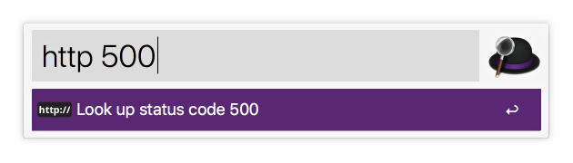
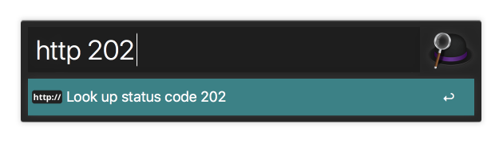

# Alfred Workflow for looking up a HTTP status code
This workflow lets you look up a HTTP status code at [HTTP
Statuses](https://httpstatuses.com/) to see what the status code means.




## Download and Install
Latest version:
[v0.1.0](https://github.com/simeg/alfred-workflow-http-status-code/archive/master.zip)

1. Download the repository
2. Open `http_status_code.alfredworkflow` by double-clicking it or dragging it
   into Alfred

## Usage
```
http <status code>
```
The `<status code>` corresponds to the status code you want to look up. After
inputting a status code and pressing enter, a new tab in your default browser
will open the result page on HTTP Status' website.

## License
(MIT) The license can be found in the [LICENSE](LICENSE.md) file.
